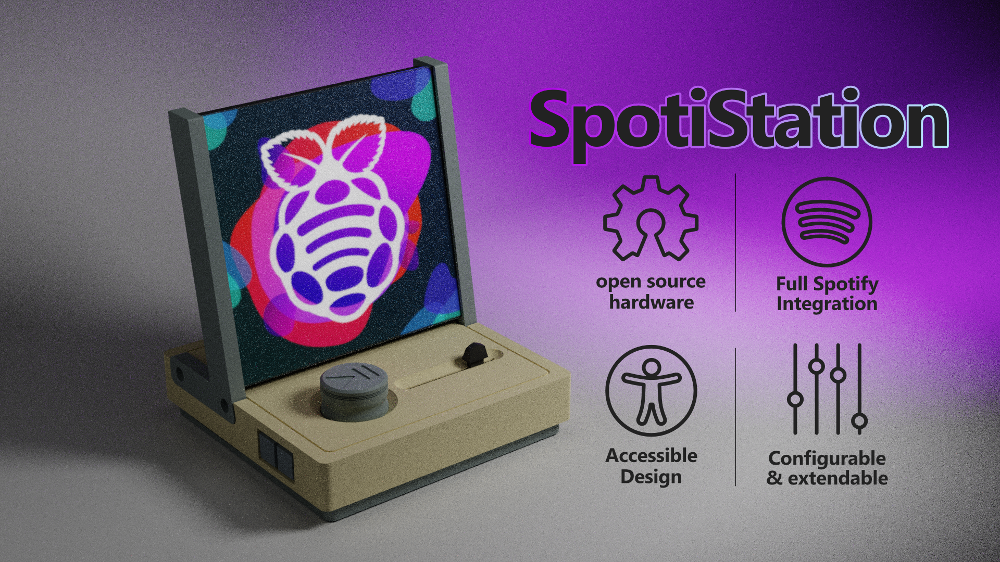
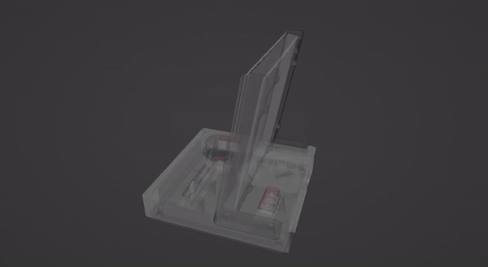

# SpotiStation - an accessible music player
A **Raspberry Pi** powered **Spotify** music player that aims to be **easy to use for people with cognitive or physical disabilities (e.g. Alzheimer's or MS)**, and allow them to enjoy music independently. 

To suit this purpose, the music player has an **extremely simple interface & operation**. A big play/pause button, a physical linear volume slider, and two side buttons that handle convenience functions, but can be omitted.

While accessibility is the primary aim of the design, this does not mean it cannot be used by a broader audience. If you like the idea of seeing the album art of your Spotify songs, and the physicality of hardware buttons, it would not look out of place in a living room. 

Features

* RGB led matrix that displays cover art and serves as basic visual interface
* Night mode that turns off the display and stops playback at user-set interval
* Lock mode, for caretakers to stop playback for a day
* Audio playback via Bluetooth simplifies wiring and mounting
* Only one plug (power supply)
* Configurable playlist selection, only use a subset of your Spotify playlist for playback
* Playback controllable via Spotify API (e.g. via phone or computer)
* Total parts cost €174 (**excluding printed parts**).
* 3D printed enclosure, making modification easy
* Open python code, low barrier to modification

### 📖 Manual

A usage manual explaining features and going into details about how features are implemented can be found [on the project wiki](https://github.com/NemoAndrea/SpotiStation/wiki).

### 🔨 Assembly

The assembly of the music player will require some dexterity, screwdrivers, and soldering setup and know-how. If you don't have a soldering setup, you could ask a friend or look for a [maker space](https://en.wikipedia.org/wiki/Hackerspace) that will have the right gear.

A [step-by-step walkthrough of assembly](docs/assembly.md) is available. 

> Feedback on what parts of the assembly are not explained well or are particularly complicated is greatly appreciated. Overly complicated steps could be fixed in future design revisions.

### 💻 Software Setup

The software setup is streamlined as much as possible, but there are some unavoidable difficult steps due to the need to fetch API keys and such for Spotify. If you know how to SSH into your Raspberry Pi, you should be good to go.

The [full step-by-step walkthrough](docs/setup.md) should let you get your own player up and running in no time! 

### 🤔 Alternative solutions

There are other simple music player that focus on accessibility for people with physical or cognitive disabilities. I suggest you check them out and see if they may be better suited for your needs. They are not open source or easily modifiable, but require minimal setup. 

* [the bbrain player](https://bbrain.eu/bbrain-muziekspeler/) - super simple operation, radio and MP3, nice administrator features (hide buttons)
* [The lift Player by smpl](https://smpltec.com/liftplayer-buy-now-us) - super simple operation, plays MP3 files, some administrator features (lock volume)
* [the relish radio player](https://relish-life.com/us/music/radios/relish-radio) - primarily a radio, but can playback MP3 from USB stick
* [the simple music player by iGuerburn](https://www.iguerburn.com/products/dementia-music-player) - plays MP3 files

And because open projects are cool, I will list some other open source projects below

* [dqmusicbox by Ross Porter](https://dqmusicbox.com/) - simple operation, plays MP3 files

### 🙏 Acknowledgements

The programmatically generated text in the UI uses the [silkscreen font by Jason Kottke](https://kottke.org/plus/type/silkscreen/). It is converted to a PIL font for display purposes.

This project is building on similar projects that use the RGB matrix to show album Art. A non-exhaustive list:

* The [spotipi project](https://github.com/ryanwa18/spotipi)  by Ryan Ward
* The [thirtytwopixels project](https://github.com/fspoettel/thirtytwopixels) by Felix Spöttel 

This project was significantly improved by insights gained during the [Delft Open Hardware Academy](https://www.openhardware.academy/01_Welcome.html). 

