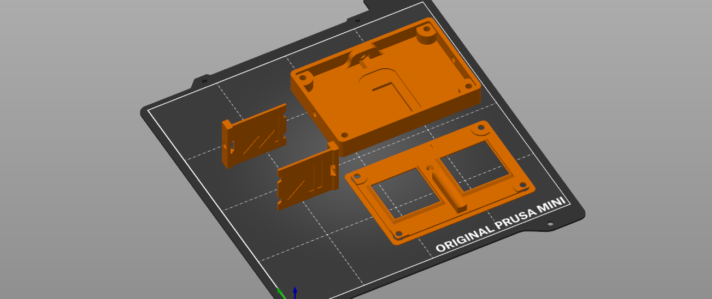
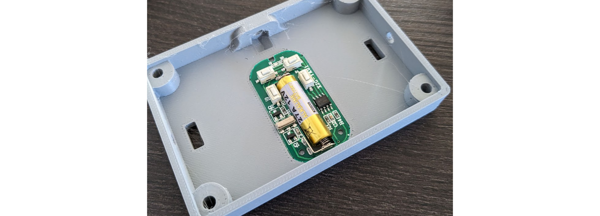
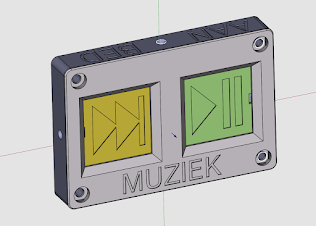
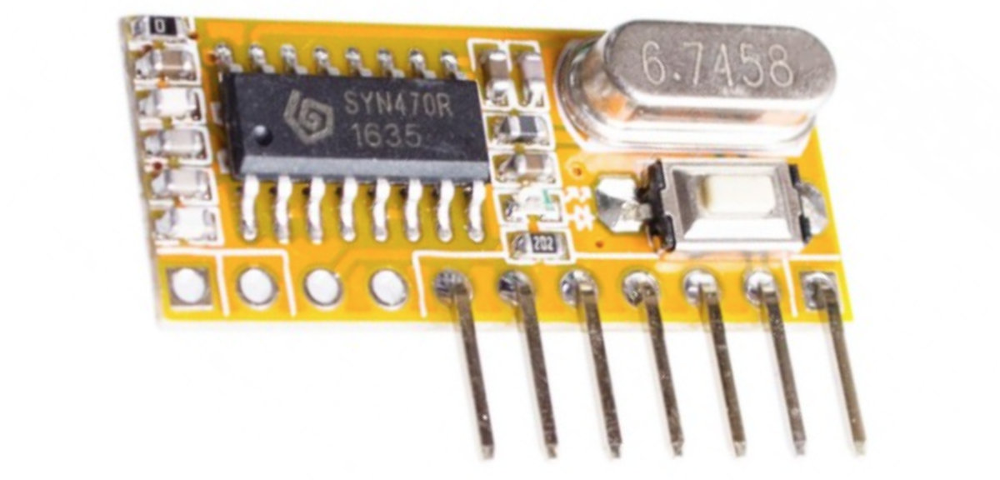
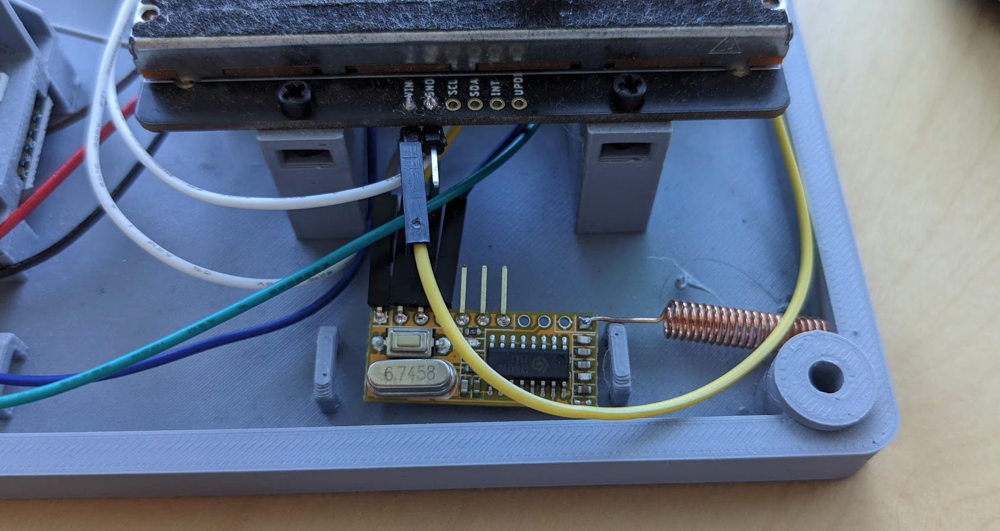

## 🎮 433MHz remote for SpotiStation

It is possible to add a simple 433 MHz remote to your SpotiStation build. This can be useful if the main player is not always accessible (e.g. when the user spends a lot of time in bed). 

😀 Keep in mind that since a remote will probably be designed around the user, you may want to deviate from the design below. Feel free to do so, and use the example below for the functional part, and design a shell of your choice around it!

### 📜 List of components

| Vendor       | Item                                                    | Amount | vendor ID | cost, total (euro) |
| ------------ | ------------------------------------------------------- | ------ | --------- | ------------------ |
| Soldered.com | 433MHz 4-channel remote controller                      | 1      | 108325    | 4                  |
| Tinytronics  | RXC6 Superheterodyne receiver with recognition function | 1      | 711       | 5                  |
| Tinytronics  | 433 MHz antenna                                         | 1      | 242       | 0.5                |
|              | 10mm M4 bolts and nuts                                  | 7      |           | 0.5                |

Total: **10 euro** (excluding printed parts)

_Note that the vendors are not critical; many stores stock essentially the same product. Have a look at the images below or look up the listed vendors above to find an equivalent at your suppliers_

### 🧰 Tools

To assemble your own remote, you will need

* Hex screwdriver or similar to secure 10mm M4 bolts
* Soldering iron to attach antenna to receiver (1 joint)
* Tools to open up SpotiStation to install receiver

### 🖨️ 3D printing

There are [4 components](../3D-printing/step) (starting with `433_remote...`) to be printed for the remote; they are not large and they all fit on the build plate. The recommended print orientation is given in the image below.

I suggest you also print the buttons in a different colour, to make it easy for the user to recognise and remember what the function of each button is.

> [!WARNING]
>
> The buttons are very thin and may fall over during printing. A brim may be useful for these parts to ensure they print reliably.

### 👷 Assembly & setup

Assembly and setup is pretty quick, and consists of the following parts:

1. Assembly of the printed remote parts
2. Wiring up the receiver & pairing it with the remote.

#### Assembly of printed parts

Start by stripping the basic 4-button remote out of its casing. 

It should now fit in the printed base part (note the orientation):

Now install the button covers (that function as levers and significantly increase the interaction area). Be careful not to overtighten the bolts as the parts are pretty thin and will crack easily. 

Finally, simply install the cover and secure it with 4 M4 bolts. Now it should look something like this:

Depending on your use case, you can design a hook, anchor or other attachment mechanism that attaches to the M4 bolt point on the topside of the remote.

#### Receiver installation and pairing

For the receiver to work you will need to solder a 433 MHz antenna onto the pin socket labelled `ANT`. Some receivers may come with an antenna included in the box, but any 433 MHz rated one will work.

Then you simply connect 3.3V to the power pin and ground (see the SpotiStation PCB for the easiest connection) and the remaining pins are determined after pairing.

Consult the manual for the specific receiver you have for pairing. The RXC6 has a simple procedure where you simply press the (only) button on the receiver untl you see the led light up, let go and then press a button on the remote to pair it. Next time that button is pressed, the button data (4-bit signal) will be output on the pins. Since most remotes have 4 buttons or less, manufacturers simply have those four buttons output `0001` `0010` `0100` and `1000`.  

For SpotiStation, pair the 4 buttons on your remote. (you can verify their output pattern via multimeter if you suspect it is not  simply``0010` etc). Then it is a matter of trial and error (if you dont have a multimeter) to figure out which button corresponds to what pin on the receiver going high. You can simply do a random wiring to the raspberry pi pins (see the PCB) and switch them around until it is correct. The [test_hardware.py](../src/test_hardware.py) script will be useful for this.

You can put the receiver somewhere inside the spotistation electronics compartment. Avoid putting it near other noisy devices such as USB cables or the display data cable.  Front of the unit works well and seems to receive remote signals from anywhere in  a small appartment.

