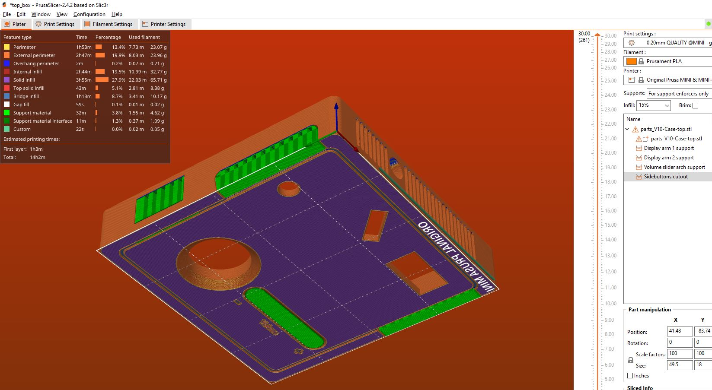
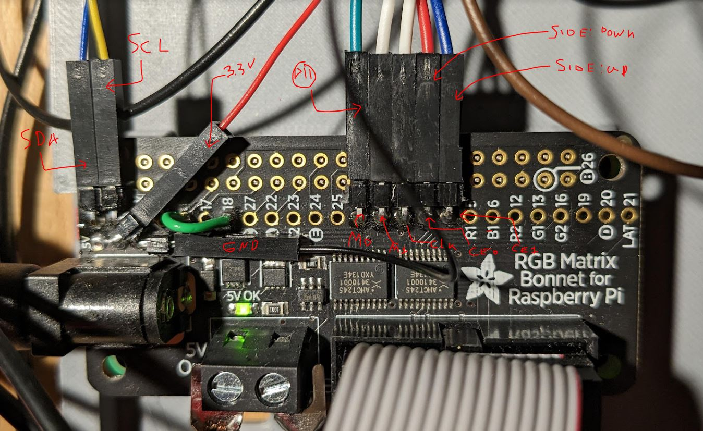
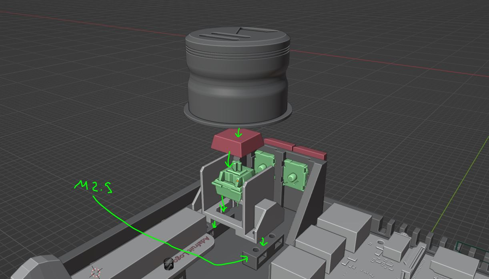

# 👷 Hardware assembly

### 📜 List of components

To build the SpotiStation, you will need to purchase the following items (or find alternatives).

| Vendor   | Item                                                         | Amount | vendor ID      | cost, total (eur) |
| -------- | ------------------------------------------------------------ | ------ | -------------- | ----------------- |
| Digi-key | Raspberry Pi Zero 2                                          | 1      | 2648-SC0510-ND | 15                |
| Adafruit | 64x64 RGB LED Matrix - 2.5mm Pitch                           | 1      | 3649           | 53                |
| Adafruit | RGB Matrix Bonnet                                            | 1      | 3211           | 15                |
| Adafruit | Black LED Diffusion Acrylic Panel 12" x 12"                  | 1      | 4594           | 9.6               |
| Adafruit | NeoKey Socket Breakout for Mechanical Key Switches with NeoPixel | 5      | 4978           | 8.4               |
| Adafruit | Adafruit NeoSlider I2C QT Slide Potentiometer                | 1      | 5295           | 9.6               |
| Adafruit | 5V 10A switching power supply                                | 1      | 658            | 28.8              |
| Adafruit | Relegendable Plastic Keycaps for MX Compatible Switches 10 pack | 1      | 5039           | 4.76              |
| Adafruit | Any MX-style keyswitch, ideally with heavy spring            | 5      | 5124           | 5                 |
| Adafruit | Black Nylon Machine Screw and Stand-off Set – M2.5 Thread    | 1      | 3299           | 17                |
| Adafruit | STEMMA QT / Qwiic JST SH 4-pin Cable with Premium Female Sockets - 150mm   Long | 1      | 4397           | 1                 |
| Adafruit | 2.54mm 0.1" Pitch 12-pin Jumper Cable - 20cm long            | 1      | 4942           | 2                 |
| Adafruit | Break-away 0.1" 36-pin strip right-angle male header (10 pack) | 1      | 1540           | 5                 |

Total: **174 Euro**

*Full-size Raspberry Pi's will also work as long as they are version 3 or newer. For version 3 you may need a USB Bluetooth adapter.

**you can get any variety (clicky, tactile or linear), but in my opinion a linear is most appropriate, and especially for the main play/pause button it would be good to have a switch that has a heavy spring (force).

***If you already have a set at home, then of course there is no need to get a full box. You will need 12 `M2.5` screws (8x `6mm`, 4x `10mm`) and matching nuts.

In addition to the items above you will need:

1. 8x `M4` `16mm` bolts and nuts.
2. 8x `M3` `12mm` bolts.
3. The 3D printed parts. Printable `stl` files can be found in [the 3D printing directory](../3D-printing/stl), and sent to a commercial 3D printing company if you do not have a printer yourself. See the assembly section below.
4. A set of Bluetooth enabled speakers. This is totally up to you, but I would **strongly** suggest you chose a (set of) speakers that are **powered from mains** and not from a battery. An example would be the [Logitech Z207](https://www.logitech.com/de-de/products/speakers/z207-stereo-speakers-bluetooth.980-001295.html), which goes for about 45 euros.

### 🧰 Tools

To assemble your own SpotiStation, you will need

* Small screwdriver to tighten down `M2.5`  screws
* Medium/large screwdriver to tighten down `M4` and `M3` screws
* Soldering iron and solder, to solder some headers onto components
* Tools to cut acrylic panel (e.g. lasercutter or blade)

### 🖨️ 3D printing

There are 4 large parts that need to be printed, and 3 smaller ones. I suggest you pick two different colours to print with for visual interest, but can pick whatever colour you like of course. ⚠️ **Note that there are two versions of the baseplate part: one for the Raspberry Pi zero format, and one for the normal full size Raspberry Pi.**

All parts can be printed without supports on an FDM printer, and all parts fit* on the buildplate of small 3D printers such as a `Prusa Mini+`. Print them as oriented in the `.stl`

The `case-top.stl` file *can* be printed without supports, but it is probably best to add some supports as depicted below.

*for the largest print it is important that you disable perimeters and purge lines on a `Prusa Mini+` as those end up outside the print volume.

### 👷 Assembly

With the parts printed, and supports removed, we can start assembly. There are two major parts to complete

1. The display assembly
2. The box assembly

Let's start with the simpler one, the display assembly.

#### Display assembly

Thread two M4 bolts (16mm) through the screw openings of the `display arms` and place in the correct position on the `top-box`

On the opposite side, (the 'inside' of the `top-box`), place two hex nuts and tighten the M4 bolts until tight. ⚠️ **Make sure that the hex nuts sit properly in the hexagonal cutout.**

Cut the `display diffuser` panel (e.g. with a lasercutter or knife) to the correct size (**161 x 168mm**)  and place it in the corresponding groove in the `display-arm`. In the image below the panel is 168mm wide, and 161mm tall. ⚠️ **Make sure the matte side of the acrylic panel faces outward (towards the user).**

Now add the other `display-arm`. ⚠️ **Make sure that the `display diffuser` slots into the groove properly on that side too.**

Time to add the actual display panel. Slide it in from the top, in between the mounting points on the `display arms` and the `display diffuser`

⚠️ **The orientation of the display is important. Ensure that it sit such that the power connectors are at the bottom and top. (see image)**

Secure the panel with 8 `M3` screws (12mm). 

That's all for the display assembly, let's move on to the main electronics box!

#### Electronics box assembly

> A small note: all the hex nuts points on the prints have a large hole for insertion of the nut, and a smaller nut on the opposite side can be used to remove the nut in case it gets stuck, or some print debris is preventing complete insertion. During printing it is possible that some filament droops down and prevent the nut from sitting right. A bit of creativity with a screwdriver is generally sufficient to remove these stray strands of filament.

Start by connecting the `stemma QT` to the neopixel slider and mounting it on the `bottom-box`. ⚠️ **The neopixel slider has two stemma QT ports. Plug it in on the side with the Adafruit logo.** The slider is secured with 4 `M2.5` screws (10mm) and corresponding nuts. ⚠️ **The neopixel slider can be mounted in two ways. Mount it with the Adafruit logo away from the box edge as in the image below**

Now it's time to mount the Raspberry Pi. Mount it with the headers pointing up and the micro-SD card slot pointing towards the outside of the `top-box`. Secure the raspberry py with 4 `M2.5` screws (6mm) and corresponding hex nuts. The micro-SD slot remains accessible (if a bit hard to reach).

With the Raspberry Pi installed add the USB Bluetooth Dongle to one of the USB ports on the Raspberry Pi. Pick one of the two lower ones.

With the raspberry pi installed, we will have to get to the soldering of headers. Some of the soldering is going to be a bit ... unconventional, but I assure you that it is required to fit within the small space the enclosure affords.

We will need to solder:

1. Headers onto the `NeoKey Sockets` facing outward [3X]
2. Headers on the `NeoKey Sockets` facing inward [2X]
3. Headers onto the `RGB matrix bonnet` 
4. Ground wires together

> **☠️ Warning: for your own health, always solder in a well ventilated area or have a system that extracts the soldering fumes.**

First, let's do the 3 outward sockets. It's going to be a huge help if you have something that can hold onto the parts while you solder (unless you have 4 arms).  Break off two pins of the right angled headers and solder them onto the NeoKey `S+` and `S-` holes.  **⚠️ Ensure you are soldering on the side with the LED (otherwise the switch wont fit!).** Have the headers point outward.

For the 2 inwards sockets, we want to do the same: break off two right angled pins and solder them on the LED side of the PCB. Solder them on the NeoKey `S+` and `S-` holes. But this time we will solder the pins **inward** and have them span over the hotswap socket. See image below. 

Then we want to solder the RGB bonnet. Here we will need to solder 9 header pins and add a short bit of wire between pins 4 and 18 to improve the image quality, as is lined out in the [RGB bonnet guide](https://learn.adafruit.com/adafruit-rgb-matrix-bonnet-for-raspberry-pi/driving-matrices). As there is limited room in the enclosure, we will again use the right-angled headers. I suggest you break of a set of 5pins, a set of 2 pins, and two single pins, and solder them as in the picture below. 

Now it is time to mount all the remaining components and wire it all up 🎉

To start with, add the  `RGB matrix bonnet` onto the raspberry pi. That should slide onto the Pi's headers with quite a lot of friction. 

Then, it is time to start connecting the switches. We will do the side buttons first. Click the MX-style switches into the ports on the side - the switches should snap right in and sit snugly.

On the backside (where the MX-switch pins are), add the *inward-facing* `NeoKeys`, with the headers pointing down as in the picture. *It ain't pretty but it will work.* I suggest you add some of the header wires onto the headers *before* you place them on the switches, but it is not a problem if you don't as the PCBs are only held in place by friction. It should look like the situation below

Now we do a similar thing for two *outward-facing* `NeoKeys`. These attach onto a separate small print, which is then attached with two `M2.5` (10mm) screws and hex nuts.

Attach the `NeoKeys` with the header pins pointing towards the `NeoSlider`. It should looks something like this:

Now all we need to do still is set up the main button `NeoKey`. This too attaches to a separate small print. This small print is attached with 4 `M2.5` (6mm) screws and nuts. It might be a bit tricky to get the hex nuts into the slots - but I assure you it is possible 😉.

On the switch, you can mount one of the `Relegendable Plastic Keycaps`, with the clear lid **taken off**. On top of that, the main play button can be placed. 

> ⚠️ Initially the button mechanism may have a lot of friction. Over some usage it will wear down and actuation will get smoother. If it is still not very smooth, you could sand down the pegs a bit on the printed part.

> The `NeoKey` PCB can be mounted either way, with the header pins pointing towards the `NeoSlider` or towards the side button. It doesn't really matter.

**🔌 Wiring **

Everything is in place, let's wire it up! Connect the `Stemma QT` cables to the pins on the `RGB matrix header` in the following way:

* Yellow wire to SDA
* Blue wire to SCL
* Red wire to +3.3V
* Black wire to GND

For all the `NeoKeys`, wire the `S+` keys to the following pins

* Main Button to `MO`
* Back button 1 (closest to Raspberry Pi) to `MI`
* Back button 2 to `CLK`
* Side button 1 (closest to Raspberry Pi) to `CE0`
* Side button 2 to `CE1` 

The 5 `S-` cables of the `NeoKeys` need to be wired to ground. The easiest way is to solder them to the `GND` pads on the ``NeoSlider`. These are connected to the Raspberry Pi ground via the `Stemma QT` connections. 

That should be most of the box set up. If you like, you can use zip ties to keep the cables in check; there are anchor points included on the box to secure the zip ties.

 If everything went well, your setup should now look something like this:

/

> Note that I used a fancy connector (orange) to connect the ground cables together; perf board would work just as well and be a lot cheaper. This connector is just handier during prototyping when it needs to be taken apart a lot.

> Note the weird Bluetooth dongle plugged into the USB port; the one listed in the parts list should be smaller and fit better.

#### Connecting the display and final assembly 

Now we are ready to connect the display to the `RGB matrix header`. Connect the ribbon cable (display data) to the corresponding port, and use the screw terminals (display power) to connect the red wire to the positive (+) terminal on the matrix header, and the black wire to the ground terminal (-). Route the cables through the dedicated cutouts on the `top box` indicated below. 

> Note: you will probably need to keep the `top box` with display assembly close to the `bottom box` as the cables are not very long.

Connect the data and power cables to the `RGB matrix panel`. 

Now it should be possible to close the assembly by placing the `top box` on top of the `bottom box`. Make sure that the `M4` hex nuts are placed in the 4 corners of the `top box` so the assembly can be firmly locked.

When closing the assembly, it is easiest to tilt in from the left side, and to leave out the keycaps on the side buttons until **after** the assembly is closed. 

> ⚠️ Make sure the main play/pause button is seated when you close the assembly.

> ⚠️ Remove the `NeoSlider` rubber dome before closing the assembly, and put it back on the slider fin when the assembly is closed. It is held in place  by friction, so it can be pulled right off.

With the assembly closed, attach the 4 `M4` screws to lock the assembly in place. 

Now you can also add those remaining keycaps to the side buttons. If you had not yet added keycaps to the back buttons, you can do so now as well. Note that the side and back buttons (unlike the one that sits underneath the main play/pause button) should **not** have the clear casing removed.

> Optionally, add some anti-slip pads to the bottom of the player to minimise sliding and to allow some airflow underneath the device.

### You have made it to the end of the assembly process 🥳, now we are ready to [set up the software side](setup.md), and test the hardware!

