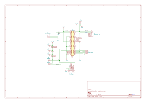

## SpotiStation shim PCB

This a simple PCB that minimises the spaghetti inside the SpotiStation enclosure. It should be fairly cheap to have it manufactured (less than 6 euros at [Aisler](https://aisler.net/)) with the most basic options.

### Edge.cuts

Board outline is specified in `edge-cuts.dxf` which is generated from the FreeCAD file `edge-cuts.FCStd` file using the 'new' dxf export.

To import it (or modified versions) to kicad, do the following:

1. Open PCB editor
2. File > Import > Graphics
3. Select the `edge-cuts.dxf` file 
4. Placement: at X=`150.82` Y=`106.32`. Make sure to import to the edge.cuts layer and keep the scale to 1. Line width can be chosen at random; 0.1mm is fine.

